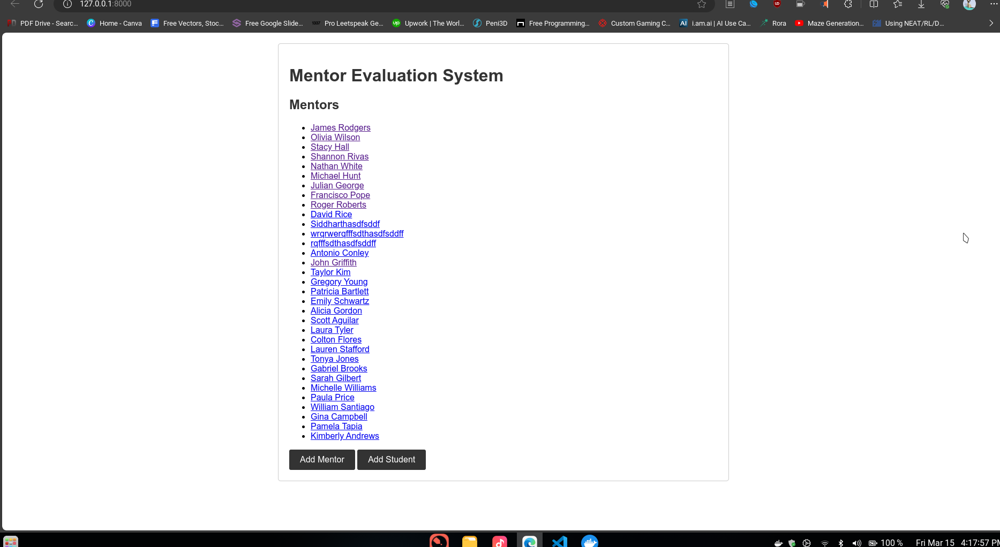
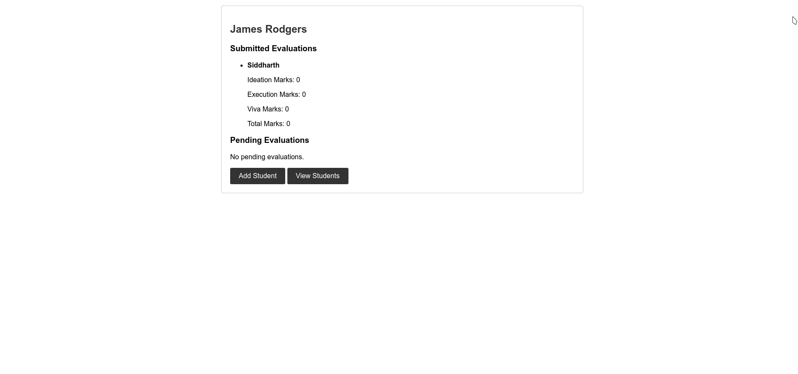
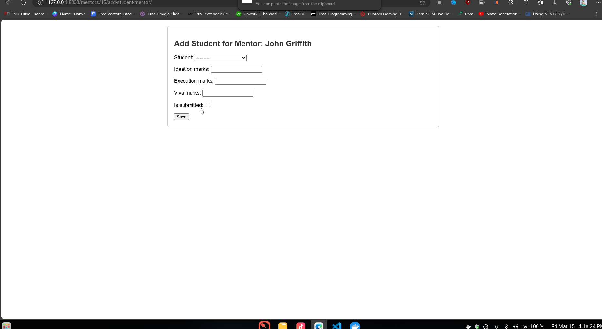
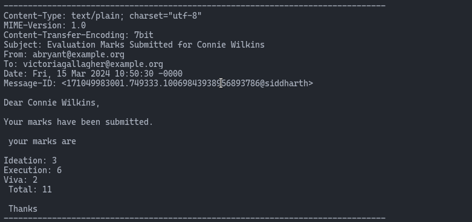
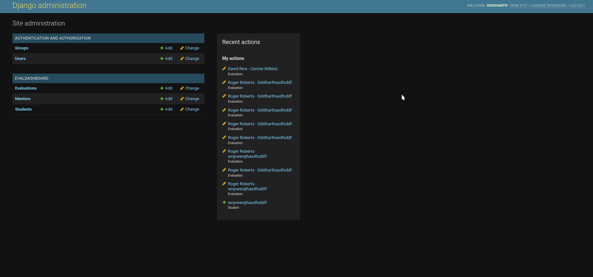

# Eval Dashboard

## Introduction

This is a project made using Django

A demonstation Video is given in the folder please do check it out 


### Features

1) Super User who can control everything (both the teachers and students)
2) Teachers can add, remove and evaluate students (when clicked submitted mail will be sent)
   1) Teachers can edit the marks any number of times and marks are set from 0-10 
   2) There 3 criterions that are present in the model to evaluate the student
3) Students can be added to the platform by the super user / teacher but can only be deleted by the super user (keeping in mind that any tacher can access the student)
4) A very neat admin page with privilages and features !!

NOTE: Teaches once clicked submit will not be able to edit the marks of the student and the student will be notified via mail (here the mail is simulated)

### Structure of the DATABASE 

The database contains 3 different tables

- Teacher
- Student
- Evaluation 

Teacher and Student

- Name
- Email
- Phone

Evaluation calss consists of the following fields

- mentor (link in DB)
- student (link in DB)
- ideation_marks
- execution_marks
- viva_marks
- total_marks
- is_submitted

if the is_submitted flag is set to True then the teacher cant change or modify the student and also the student will be sent mail.


# Running the container 

Clone the repository from my github 

```github
git clone https://github.com/Siddhu2502/MentorStudent
```
then start docker daemon 

```github
sudo systmctl start docker
```

be in the directory which has the dockerfile 

```github
sudo docker build -t evaldashboard .
sudo docker run -p 8000:8000 evaldashboard
```

This wil run the docker container and the app will be up and running

Creating the admin/superuser

```github
sudo docker exec -it <container id> /bin/bash
```
The container name is 'EVALDASHBOARD' (small letters)


after running these you can either add data manually the following commands and put the data automatically for further analysis

```python
from evaldashboard.models import Mentor, Student
from faker import Faker

fake = Faker()

# Generate and save fake data
for _ in range(10):
    obj = Mentor(
        name=fake.name(),
        email=fake.email(),
        phone=fake.phone_number()
    )
    obj.save()

for _ in range(20):
    obj = Student(
        name=fake.name(),
        email=fake.email(),
        phone=fake.phone_number()
    )
    obj.save()
```


# Screenshots of the Application








# Some points to be noted (from django side)

Django provides very robust backend and hence I have choosen django for the backend and front end contains simple html css (html templates which renders using jinja templating engine hence i was unable to create a single page applicatoin but all the efforts were taken) !

Had issues with AWS as it was not accepting any govt. related bank card hence i have switched to making the entire process in docker so that there wont be any hassle in setting up project and running it in local computer itself